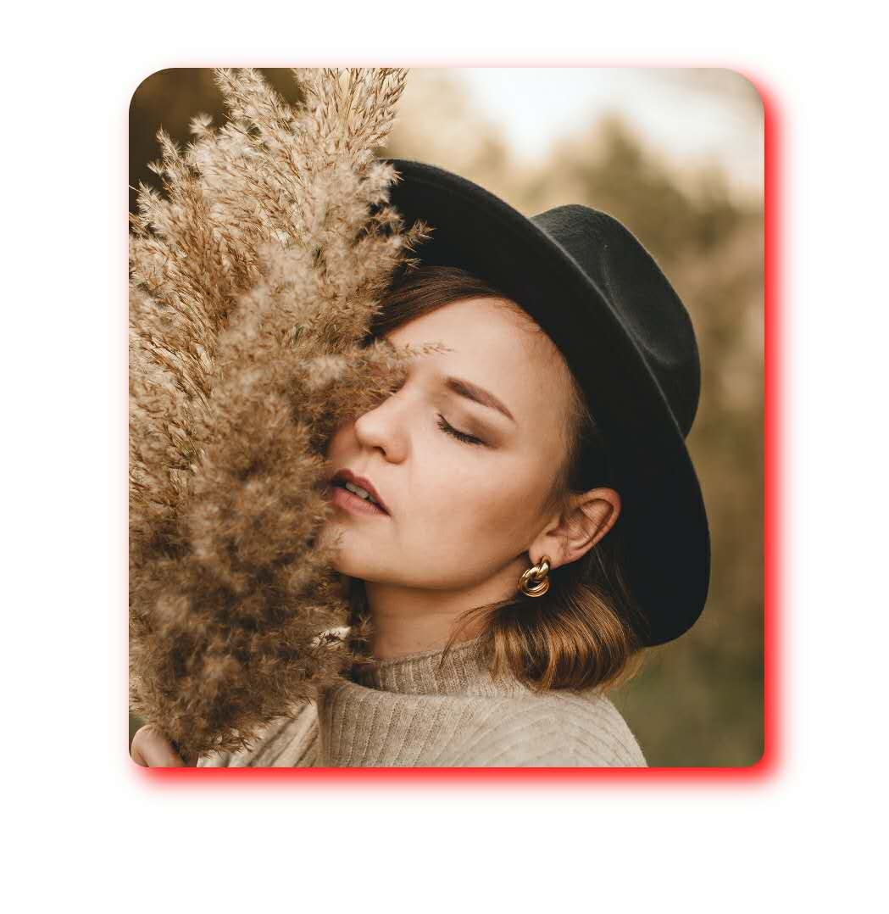

# BoxShadowLayout
实现了类似css3中的box-shadow 属性，并且支持裁减圆角像CardView一样。阴影不占据View的空间。以实现类似ios的阴影效果

## Shadow Properties
xml 属性|方法|对应的css中box-shadow属性|描述
--|--|--|--|--
shadowOffsetVertical | setShadowVerticalOffset() | h-shadow |水平阴影的位置。允许负值
shadowOffsetHorizontal | setShadowHorizontalOffset() | v-shadow|垂直阴影的位置。允许负值
shadowBlur | setShadowBlur() | blur | 模糊距离
shadowSpread| setShadowSpread() | spread | 阴影的大小
shadowColor | setShadowColor |color | 阴影的颜色
shadowInset | setShadowInset | inset | 从外层的阴影（开始时）改变阴影内侧阴影

## Radius Properties
radius attr | method |desc
--|--|--
boxRadius | setBoxRadius() | 设置4角圆角大小
boxRadiusTopLeft|setBoxRadius()| 设置左上圆角大小
boxRadiusTopRight|setBoxRadius()| 设置右上圆角大小
boxRadiusBottomLeft|setBoxRadius()| 设置左下圆角大小
boxRadiusBottomRight|setBoxRadius()| 设置右下圆角大小

## 实例 xml
```xml
<pokercc.android.boxshadowlayout.BoxShadowLayout
    android:layout_width="match_parent"
    android:layout_height="wrap_content"
    android:layout_gravity="center"
    android:layout_marginStart="60dp"
    android:layout_marginEnd="60dp"
    app:boxRadius="20dp"
    app:boxRadiusBottomLeft="8dp"
    app:boxRadiusBottomRight="8dp"
    app:layout_constraintBottom_toBottomOf="parent"
    app:layout_constraintEnd_toEndOf="parent"
    app:shadowBlur="8dp"
    app:shadowColor="#f00"
    app:shadowInset="false"
    app:shadowOffsetHorizontal="5dp"
    app:shadowOffsetVertical="5dp">

    <ImageView
        android:layout_width="match_parent"
        android:layout_height="wrap_content"
        android:scaleType="centerCrop"
        android:src="@drawable/unsplash_01"
        tools:ignore="ContentDescription" />
</pokercc.android.boxshadowlayout.BoxShadowLayout>
```

## 效果图
